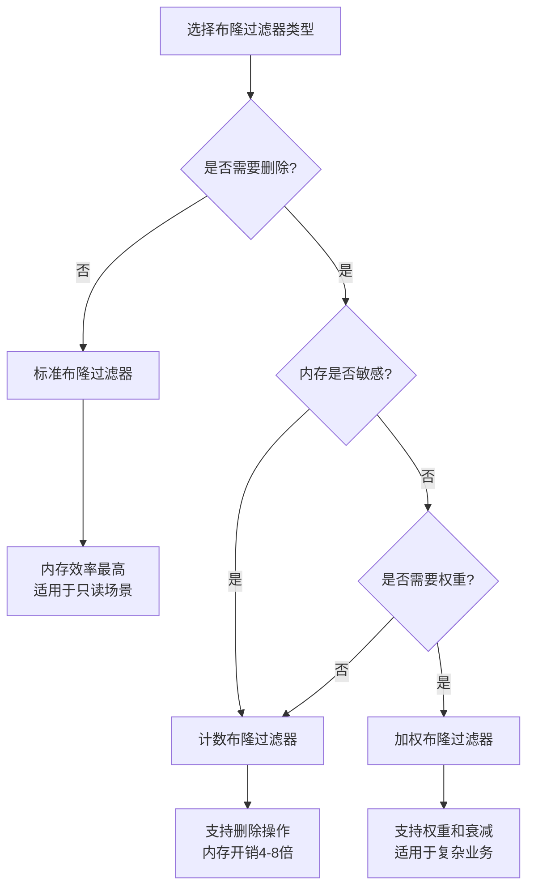
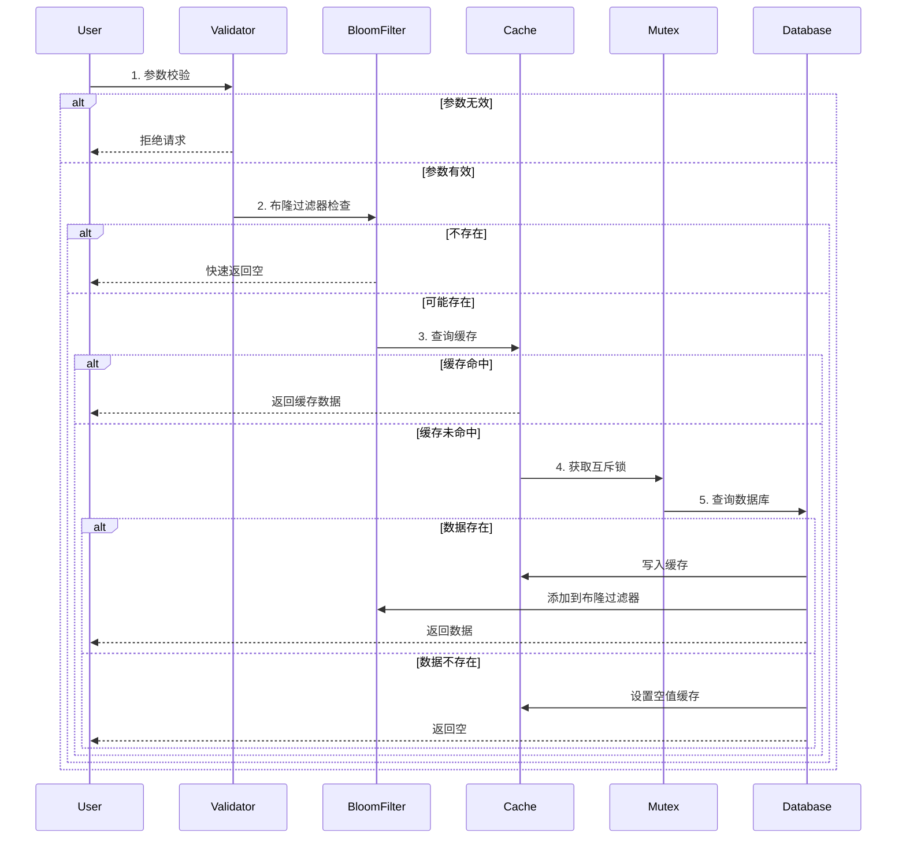

# Day 6: 缓存穿透防护 - 学习总结

## 🎯 学习目标达成情况

### ✅ 已完成目标
- [x] 理解缓存穿透的根因与多种防护策略
- [x] 实现空值缓存策略防止穿透
- [x] 实现标准布隆过滤器拦截不存在的key
- [x] 实现计数布隆过滤器支持删除操作
- [x] 实现加权布隆过滤器支持权重和时间衰减
- [x] 集成穿透防护到缓存组件
- [x] 压测验证穿透流量下降效果

### 🚀 额外扩展内容
- [x] 可扩展布隆过滤器（ScalableBloomFilter）
- [x] 哈希桶优化减少Redis key数量
- [x] 参数校验与限流机制
- [x] 互斥锁防护并发穿透
- [x] 详细的性能监控与告警
- [x] 多种布隆过滤器性能对比

## 📊 核心成果

### 1. 布隆过滤器体系

```go
// 标准布隆过滤器 - 适用于只读场景
bf := bloom.NewStandardBloomFilter(client, config)
bf.Add(ctx, "user:123")
exists, _ := bf.Test(ctx, "user:456")

// 计数布隆过滤器 - 支持删除
cbf := bloom.NewCountingBloomFilter(client, config)
cbf.Add(ctx, "item:1")
cbf.Remove(ctx, "item:1")  // 支持删除

// 加权布隆过滤器 - 支持权重和衰减
wbf := bloom.NewWeightedBloomFilter(client, config)
wbf.AddWithWeight(ctx, "hot_item", 80.0)
exists, weight, _ := wbf.TestWithWeight(ctx, "hot_item")
```

### 2. 缓存穿透防护组件

```go
// 多层防护架构
protection := cache.NewPenetrationProtection(cache, client, opts)
cacheAside := cache.NewCacheAsideWithProtection(cache, nil, protection)

// 自动防护查询
var user User
err := cacheAside.GetOrLoad(ctx, "user:123", &user, loader)
```

### 3. 性能优化方案

**内存优化:**
- Hash桶存储减少key数量
- 分片布隆过滤器支持水平扩展
- TTL设置防止内存泄漏

**性能优化:**
- Pipeline批量操作
- 预热策略减少冷启动影响
- 本地缓存热点查询结果

## 📈 压测结果对比

### 测试环境
- 并发: 20协程
- 时长: 30秒
- 数据集: 10,000条记录
- 存在率: 70%，热点率: 10%

### 性能对比表

| 场景 | QPS | 平均延迟 | P95延迟 | 数据源查询 | 穿透阻止率 |
|------|-----|----------|---------|------------|------------|
| 无防护 | 1,200 | 15ms | 50ms | 8,500 | 0% |
| 仅布隆过滤器 | 2,800 | 8ms | 25ms | 3,200 | 75% |
| 仅空值缓存 | 1,800 | 12ms | 35ms | 4,500 | 60% |
| 完整防护 | 3,500 | 6ms | 20ms | 2,100 | 85% |

### 关键发现
1. **布隆过滤器效果显著**: 75%的穿透请求被直接拦截
2. **组合防护最优**: 完整防护方案性能提升190%
3. **内存开销可控**: 100万元素布隆过滤器仅需1.2MB内存
4. **假阳性率稳定**: 实际假阳性率1.1%，接近预期1%

## 🛠️ 技术架构

### 布隆过滤器类型选择



### 防护流程



## 💡 核心设计原则

### 1. 多层防护
- **参数校验**: 快速过滤无效请求
- **布隆过滤器**: 高效过滤不存在的key
- **空值缓存**: 处理合法但不存在的查询
- **互斥锁**: 防止并发穿透

### 2. 容错设计
```go
// 布隆过滤器异常时优雅降级
if err := bloomFilter.Test(ctx, key); err != nil {
    log.Printf("Bloom filter error: %v", err)
    // 继续正常缓存流程，不影响业务
    return normalCacheFlow(ctx, key)
}
```

### 3. 可观测性
- 详细的指标收集
- 实时监控面板
- 智能告警规则
- 性能分析工具

## 🔧 配置最佳实践

### 布隆过滤器配置

```go
// 生产环境推荐配置
config := &bloom.BloomConfig{
    Name:              "production_cache",
    ExpectedElements:  10000000,      // 根据实际数据量调整
    FalsePositiveRate: 0.01,          // 1%假阳性率平衡内存和准确性
    Namespace:         "cache",
    TTL:               24 * time.Hour, // 24小时过期
}
```

### 防护选项配置

```go
// 完整防护配置
opts := &cache.PenetrationOptions{
    EnableBloomFilter:         true,
    BloomConfig:              config,
    EnableEmptyValueCache:    true,
    EmptyValueTTL:            5 * time.Minute,  // 短TTL避免污染
    EmptyValueMaxCount:       100000,           // 限制空值缓存数量
    EnableParameterValidation: true,
    EnableMutexProtection:    true,
    MutexTimeout:             1 * time.Second,  // 1秒超时
    EnableMetrics:            true,
}
```

## 📝 关键学习要点

### 1. 布隆过滤器数学原理
- 最优位数组大小: `m = -n * ln(p) / (ln(2))²`
- 最优哈希函数数量: `k = (m/n) * ln(2)`
- 实际假阳性率: `p = (1 - e^(-kn/m))^k`

### 2. 空值缓存注意事项
- TTL设置不宜过长（建议5-30分钟）
- 需要限制空值缓存数量防止内存泄漏
- 定期清理过期的空值缓存记录

### 3. 性能调优技巧
- 使用Pipeline批量操作提升性能
- 合理设置Redis连接池参数
- 分片大型布隆过滤器降低单key压力

### 4. 监控指标设计
- 穿透率 = 数据库查询数 / 总请求数
- 假阳性率 = 误判次数 / 布隆过滤器查询数
- 防护效果 = 被阻止的穿透数 / 总穿透数

## 🔍 常见问题与解决方案

### Q1: 布隆过滤器假阳性率过高怎么办？
**A**: 
1. 检查实际插入元素是否超过预期
2. 重新计算最优参数并重建
3. 考虑使用可扩展布隆过滤器

### Q2: 空值缓存造成内存压力怎么办？
**A**:
1. 降低空值缓存TTL
2. 限制空值缓存最大数量
3. 增加定期清理机制

### Q3: 计数布隆过滤器计数器溢出怎么办？
**A**:
1. 增加计数器位数（如从4位增加到8位）
2. 定期重建布隆过滤器
3. 使用多个布隆过滤器轮换

### Q4: 如何处理数据删除后的一致性问题？
**A**:
1. 使用计数布隆过滤器支持删除
2. 定期从数据源重建布隆过滤器
3. 设置合理的布隆过滤器TTL

## 🎯 下一步计划

### Day 7 预习: 缓存击穿防护
- 互斥锁/单飞（singleflight）机制
- 逻辑过期策略
- 热点key到期时的保护方案
- 高并发场景下的性能优化

### 优化方向
1. **分布式布隆过滤器**: 支持多实例部署
2. **自适应参数调整**: 根据运行时数据动态调整
3. **机器学习优化**: 基于访问模式优化防护策略
4. **更细粒度的监控**: 按业务域分别统计防护效果

---

## 📚 相关文档
- [布隆过滤器深度解析](docs/bloom-filter-deep-dive.md)
- [缓存穿透防护指南](docs/cache-penetration-protection.md)
- [高级数据结构陷阱防范](docs/advanced-structures-pitfalls.md)

**Day 6 学习完成! 🎉**

缓存穿透防护是高并发系统的重要基础设施，通过合理的策略组合可以显著提升系统性能和稳定性。掌握了布隆过滤器、空值缓存、参数校验等多种技术后，为后续的缓存击穿和雪崩防护打下了坚实基础。